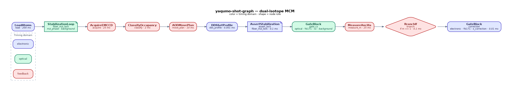
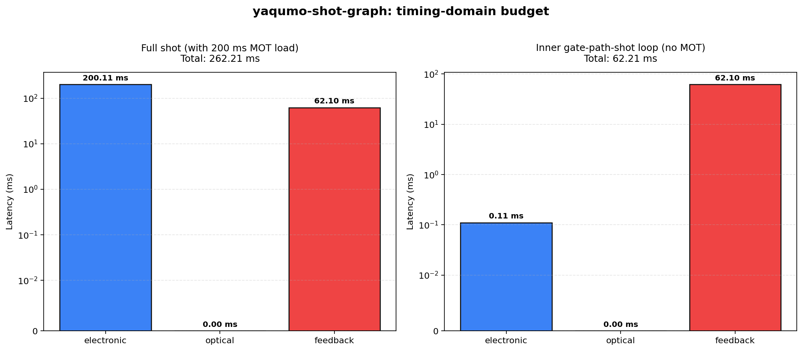
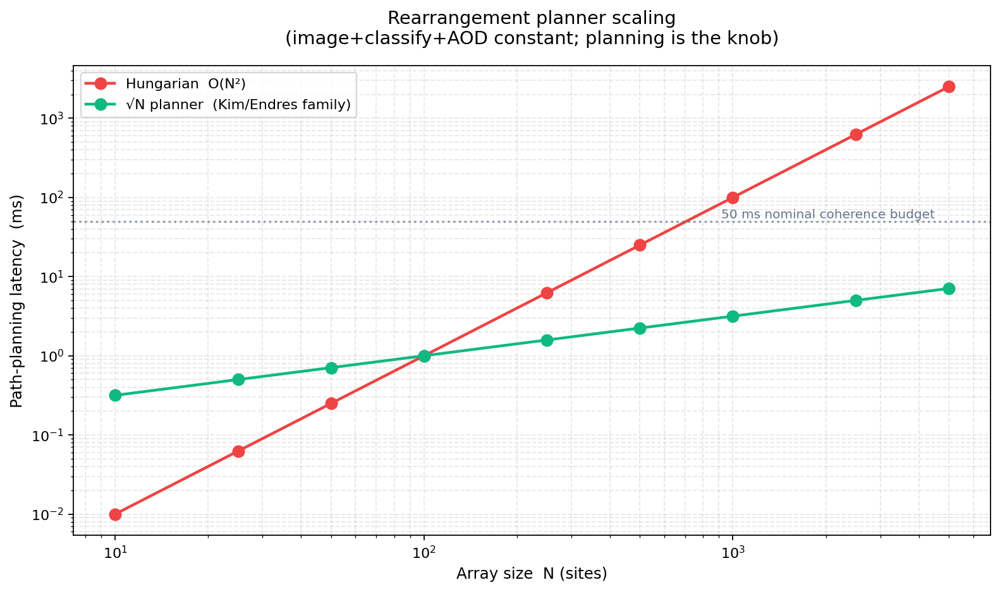

# yaqumo-shot-graph

Honest middleware for neutral-atom quantum control.




> ## ⚠️ Scope note
>
> This is a 10-hour architectural speed-run, not a scientific contribution. The repo sketches one way to think about a neutral-atom control stack from the software-engineering side — cited papers frame decisions, they are not reproduction targets. Treat it as a conversation starter for the role I applied to, not as working lab software.

*11-node dual-isotope shot graph (¹⁷¹Yb qubit + ¹⁷⁴Yb ancilla MCM). Node color encodes timing domain: blue = electronic, green = optical (CPA gate + fiber-MZI feedforward), red = classical-feedback.*

## Why this specific stack

Yaqumo is not *generic* neutral-atom quantum computing. It is a specific mashup of two Japanese academic traditions plus a domestic controller direction, and every design choice in this repo leans on those signatures — not on what QuEra, Pasqal, or Atom Computing do.

| Signature | Yaqumo (JP) | QuEra (USA) | Pasqal (EU) | Atom Computing (USA) |
|---|---|---|---|---|
| **Species** | ¹⁷¹Yb + ¹⁷⁴Yb dual-isotope (Kyoto/Takahashi) | Rb-87 | Rb-87 / Sr-88 | Sr-88 |
| **Non-destructive ancilla imaging** | ¹⁷⁴Yb bosonic ancilla imaged at 399 nm (PRX 2024)² | Erasure conversion (different mechanism) | Not standard | Not standard |
| **Rydberg gate regime** | Ultrafast **CPA picosecond pulses** — **~6.5 ns** Förster oscillation on **⁸⁷Rb** (Chew/Tomita/Ohmori, Nat. Photonics 16, 724, 2022, [arXiv:2111.12314](https://arxiv.org/abs/2111.12314); 100× faster than µs-regime) — Yb port targeted³ | MHz Rabi (~µs) | MHz Rabi (~µs) | MHz Rabi (~µs) |
| **Tweezer arrays** | 2D AOD 532 nm⁴ + 3D SLM combo | 2D AOD only | 2D + 3D | 2D AOD |
| **Controller stack** | QuEL multi-FPGA (ICCE 2025, domestic) | Custom | Custom + Zurich/Qblox | Custom |
| **Capital source** | Moonshot Goal 6 sovereign + Quantonation + Kyoto-iCAP | VC (Safar, HV) | VC + ESA/EU | VC |


² PRX 2024 demonstrates non-destructive *imaging* of ¹⁷⁴Yb while ¹⁷¹Yb coherence is preserved — a prerequisite for full MCM, not the full MCM feedback cycle.

³ Nature Photonics 2022 demonstrated the 100× speedup on **⁸⁷Rb**; the Yaqumo differentiation rests on porting this regime to Yb — a targeted engineering direction, not yet a published Yb result.

⁴ 532 nm tweezer wavelength is standard in IMS Okazaki setups (Nishimura et al., PRA 113, 013119, 2026, [arXiv:2411.03564](https://arxiv.org/abs/2411.03564)); Kyoto setup wavelength may differ — cited directionally.
The IR in this repo models those specific choices as first-class:

- `AtomSpecies.YB171` / `YB174` / `YB173` — not a generic `Atom` enum
- `GateBlock(gate_mechanism="optical")` — forces the ultrafast CPA path into the OPTICAL timing domain, separate from the MHz electronic regime most neutral-atom stacks use
- `StabilizationLoop` + `AssertStabilization` — IR slot for the fast laser-phase-noise feedforward correction (Denecker et al., [arXiv:2411.10021](https://arxiv.org/abs/2411.10021), 1–10 MHz band, 20–30 dB suppression) that the CPA regime needs for high-fidelity Rydberg gates
- `DeviceClass.FPGA_CTRL` — reserved slot for QuEL's heterogeneous multi-FPGA direction (Miyoshi, Tomita, de Léséleuc et al., ICCE 2025), rather than defaulting to Zurich Instruments' vocabulary

A recruiter reading this repo should not mistake it for I know neutral-atom control in general. The signal is more specific: *I read Nakamura PRX 2024, I saw Ohmori's CPA regime is not MHz-scale, and I know QuEL exists.*

## What this repo is

A typed shot-graph IR and heterogeneous-backend compiler that models the software boundary between high-level experiment description and physical lab devices (NI-DAQ, AD9910 DDS, EMCCD cameras, SLMs, optical delay lines).

The IR explicitly represents three timing domains — **electronic**, **optical**, and **classical-feedback** — and compiles to backend command streams that a real lab runtime could execute.

## What this repo is not

> This repository simulates the software boundary between experiment description and heterogeneous lab devices; it does not claim to reproduce Yaqumo's physics performance or proprietary hardware.

- Not a quantum-state simulator
- Not a drop-in replacement for ARTIQ, QICK, QCoDeS, or labscript
- Not a production lab runtime
- Not a claim to physics expertise — this is control-systems software for an AMO lab reality

## Headline result



The full shot cycle is dominated by the 200 ms MOT load (honest — that is one-shot setup). **The inner gate-path-shot loop tells a different story**: classical feedback (62.1 ms) dominates the electronic domain (0.02 ms) by three orders of magnitude. That is the engineering problem a neutral-atom control-systems engineer actually solves.

## Why this matters — literature receipts

Published imaging numbers from Yaqumo's founding labs (verbatim in [REFERENCES.md](REFERENCES.md)):

| Source | Config | Exposure |
|---|---|---|
| Nakamura et al., [arXiv:2406.12247](https://arxiv.org/abs/2406.12247) abstract | 2D ¹⁷¹Yb/¹⁷⁴Yb, non-destructive | **20 ms** |
| Kusano et al., [arXiv:2501.05935](https://arxiv.org/abs/2501.05935) §3D Tweezer Array | 3D, per plane | **60 ms** + 20 ms refocus |
| Kusano et al., [arXiv:2602.22883](https://arxiv.org/abs/2602.22883) App. A | ¹⁷³Yb, 1.09 mK trap¹ | **12 ms** |

¹ ¹⁷³Yb (I=5/2) at 1.09 mK — polarizability differs from ¹⁷¹Yb/¹⁷⁴Yb; lower-bound reference only, not a direct spec transfer.

Ultrafast Rydberg gate timing lives in a separate *optical* domain — Ohmori et al. ([arXiv:2311.15575](https://arxiv.org/abs/2311.15575) abstract) report picosecond pulses driving nanosecond dynamics with attosecond-precision mechanical delay. That is outside the electronic sequencer the IR compiles to, which is why `ir/types.py` makes the three domains non-collapsible.

## Rearrangement planner scaling



Path-planning cost is the knob. Hungarian assignment is O(N²) and crosses a nominal **50 ms engineering budget** around N ≈ 1000 (this is an illustrative default, not a physics coherence time — PRX 2024 reports ¹⁷¹Yb T₂* = 77(2) ms under 399 nm imaging). A √N-family planner stays sub-millisecond up to 5000 sites — the regime Yaqumo is actually targeting. The shot-graph IR parameterises this as a first-class `AODMovePlan.algorithm` field.

## Quick example

```python
from yaqumo_shot_graph import ShotGraph, nodes
from yaqumo_shot_graph.scheduler import compile_graph
from yaqumo_shot_graph.sim import latency_budget

g = ShotGraph()
g.add(nodes.LoadAtoms(name="load", species="Yb171", count=100))
g.add(nodes.AcquireEMCCD(name="img", exposure_ms=20))  # 20 ms anchors arXiv:2406.12247 §III
g.add(nodes.ClassifyOccupancy(name="cls"))
g.add(nodes.AODMovePlan(name="rearr", algorithm="sqrt_t"))
g.add(nodes.GateBlock(name="gate", species="Yb171", gate_name="cz"))
g.add(nodes.MeasureAncilla(name="mcm", species="Yb174"))
g.add(nodes.BranchIf(name="ff", condition="m == 1"))

streams = compile_graph(g)
print(latency_budget(g).format_table())
```

## Run it yourself

```bash
# clone + install
git clone <this-repo>
cd yaqumo-shot-graph
python -m venv .venv && source .venv/bin/activate
pip install -e '.[dev,export,viz]'

# run the main demo (text output)
python examples/01_dual_isotope_feedback.py

# regenerate plots in docs/images/
python examples/_viz_shot_graph.py
python examples/_viz_latency.py

# full test suite (108 tests)
pytest -q

# type check + lint
mypy src/yaqumo_shot_graph/
ruff check src/ tests/ examples/
```

## Repository layout

```
src/yaqumo_shot_graph/
├── ir/          typed DAG: 13 node types, 3 timing domains, pydantic models
├── scheduler/   compile shot-graph → per-backend command streams
├── backends/    Backend ABC + NI-DAQ adapter, AD9910 SPI model, EMCCD + SLM mocks, optical-delay stub
├── sim/         latency-budget aggregation + feedback-loop simulation
└── export/      read-only export to OpenQASM 3 and Pasqal Pulser (non-runtime)

tests/           108 tests · pytest · ruff · mypy --strict
examples/        01_dual_isotope_feedback.py · 02_rearrangement_scaling.py · _viz_*.py
docs/images/     generated plots committed for GitHub browsing
```

## Design authority

All design decisions trace to `internal design notes` (kept offline — not in this repo). That document is the single source of truth for what hardware this IR targets and what it rejects.

## License

**PolyForm Noncommercial 1.0.0** — source-visible, non-commercial use only.
See [LICENSE](LICENSE) for the full terms. Commercial licensing inquiries: contact .

No **GPL/LGPL** code copied or ported. Small MIT-licensed adaptations
from QICK and QCoDeS are attributed in
[THIRD_PARTY_NOTICES.md](THIRD_PARTY_NOTICES.md) and
[REFERENCES.md](REFERENCES.md).
